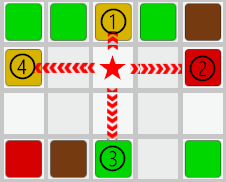

# ColorTilePuzzle

# 操作説明
</img>   
タイルの無い場所をクリックします。   
クリックした場所から上下左右の4方向でそれぞれ一番近いタイルの中で、   
同じ色の組み合わせがあればスコアが加算されて、タイルが消えます。   
組み合わせが無い場合は残りタイムが減少します。  
※★がクリック位置で上下左右の4方向の一番近いタイルは①、②、③、④のタイルです。  
　①と④が同じ色のタイルなのでスコアが加算されます。

# 制作環境
Unity 2021.3.29f1

# 制作テーマと注意事項
・テーマ：「交わる」   
・制作期間は1ヵ月(9/30まで)   
・いくつかのデザインパターンを用いた開発とする   

# 仕様書
・画面タイルは縦12マス x 横24マスとする。   
・画面左上にタイム、右上にスコアを表示する。  
・タイルの色の種類は赤、緑、青、黄、ピンク、オレンジ、シアン、グレー、ブラウン、紫の10種類。   
・タイムは2分。   
・タイトル画面のPlayボタンを押した瞬間からゲームスタート、タイマーもスタートする。  
・タイマーが0になったらゲームオーバー画面を表示する。  
　ゲームオーバー画面はスコアとRetryボタンを表示し、Retryボタンを押すと最初からゲームを開始する。  
・タイルの無い場所のみクリックできる。タイルのある場所はクリックできない。   
・タイルの無い場所をクリックした際、クリックした場所から上下左右の一番近いタイルを取得し、   
　同じ色の組み合わせがあればスコアを加算してタイルを消す。  
　取得した上下左右のタイルの中に同じ色の組み合わせが無ければタイムを10秒減少させる。  
・スコアは消したタイル1つにつき1点。2つなら2点、3つなら3点、最大の4つなら4点。  
・連続で消した場合はコンボ表示を行い、スコアにコンボボーナスをつける(2連続は2倍、3連続は3倍、4連続は4倍...)  
　ただし、消せなかった場合はコンボボーナスをリセットする(初期値は1倍)
  
# 使用したデザインパターン
・Singleton  
・Action  
・State

# 使用したアセット
・TextMeshPro  
  
・魔王魂  
　https://maou.audio/  
   
・Effect textures and prefabs  
　https://assetstore.unity.com/packages/vfx/particles/effect-textures-and-prefabs-109031
